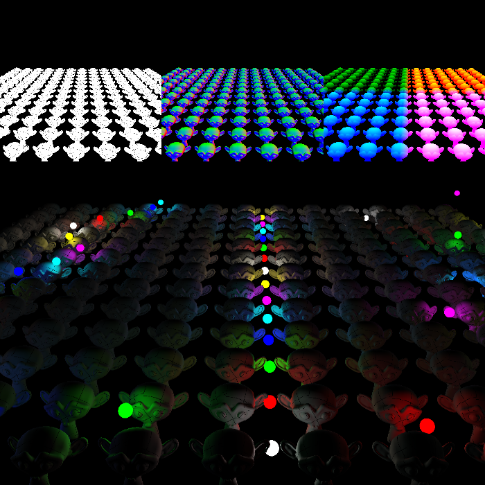

# deffered-lighting-demo
Demonstration of deffered lighting.

<kdb></kdb>

## controls
|key press| action|
|:-:|-|
|w,a,s,d| fps movement controls for forward, backward, right, and left motion|
| space and shift| ascend and descend|
|mouse|look control|
|'e'|place a light at camera location|
|'q'|cycle render stage textures|
|'f'|take a screenshot (saved as 'screenshot.bmp' in the working directory)|